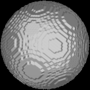
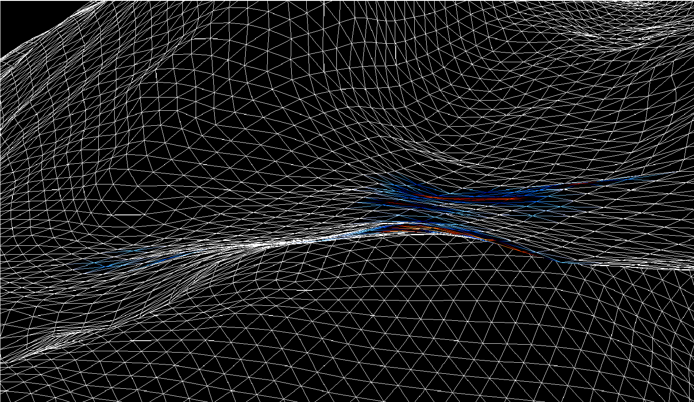
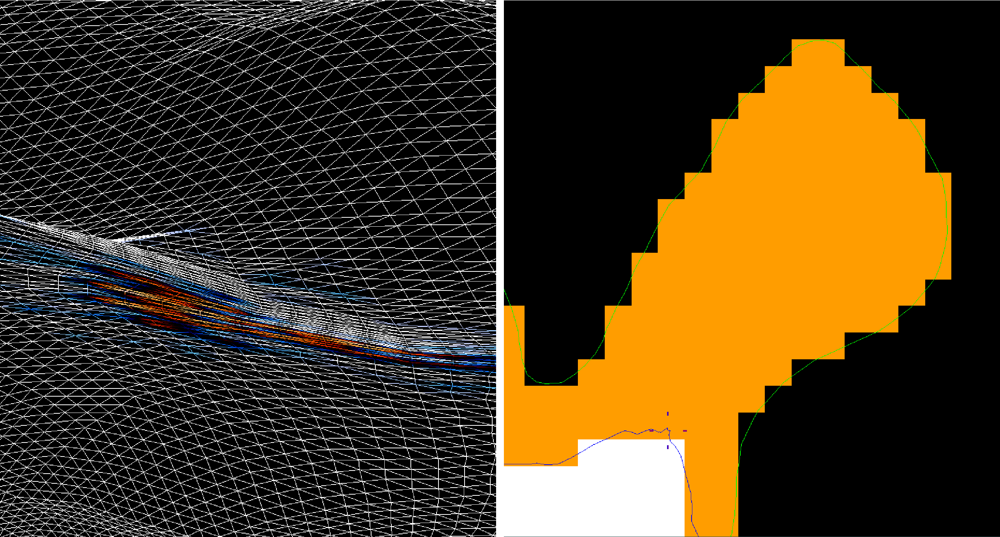

# Surface Smoothness Error

[](https://hub.docker.com/r/fnndsc/pl-smoothness-error)
[](https://github.com/FNNDSC/pl-smoothness-error/blob/main/LICENSE)
[](https://github.com/FNNDSC/pl-smoothness-error/actions/workflows/ci.yml)

<div style="text-align: center">




</div>

## Abstract

`pl-smoothness-error` is a _ChRIS_ _ds_ plugin which calculates the mean difference
in mean curvature about every vertex with its neighbors of a .obj surface mesh.
It is for assessing the quality of surfaces.

## Data Visualization

`.obj` surface files and `.txt` vertex-wise text data can be visualized using:

- Online: [BrainBrowser (Natacha's fork)](https://natacha-beck.github.io/brainbrowser/BrainBrowserSurfaceUI/)
- Online: [BrainBrowser (original)](https://brainbrowser.cbrain.mcgill.ca/surface-viewer)
- Non-interactive: [`ray_trace`](https://www.bic.mni.mcgill.ca/~david/Ray_trace/ray_trace_tutorial.html)
- Local, interactive: `brain-view` (lost in time...)

Hot-spots of large smoothness error can be used to detect errors on surfaces.




## Installation

`pl-smoothness-error` is a _[ChRIS](https://chrisproject.org/) plugin_, meaning it can
run from either within _ChRIS_ or the command-line.

[](https://chrisstore.co/plugin/pl-smoothness-error)

## Local Usage

To get started with local command-line usage, use [Apptainer](https://apptainer.org/)
(a.k.a. Singularity) to run `pl-smoothness-error` as a container:

```shell
apptainer exec docker://fnndsc/pl-smoothness-error smtherr [--args values...] input/ output/
```

To print its available options, run:

```shell
apptainer exec docker://fnndsc/pl-smoothness-error smtherr --help
```

## Examples

`smtherr` requires two positional arguments: a directory containing
input data, and a directory where to create output data.
First, create the input directory and move input data into it.

```shell
mkdir incoming/ outgoing/
mv white_matter_81920.obj incoming/
apptainer exec docker://fnndsc/pl-smoothness-error:latest smtherr [--args] incoming/ outgoing/
```

## Development

Instructions for developers.

### Building

Build a local container image:

```shell
docker build -t localhost/fnndsc/pl-smoothness-error .
```

### Get JSON Representation

Run [`chris_plugin_info`](https://github.com/FNNDSC/chris_plugin#usage)
to produce a JSON description of this plugin, which can be uploaded to a _ChRIS Store_.

```shell
docker run --rm localhost/fnndsc/pl-smoothness-error chris_plugin_info > chris_plugin_info.json
```

### Local Test Run

Mount the source code `smtherr.py` into a container to test changes without rebuild.

```shell
docker run --rm -it --userns=host -u $(id -u):$(id -g) \
    -v $PWD/smtherr.py:/usr/local/lib/python3.10/site-packages/smtherr.py:ro \
    -v $PWD/in:/incoming:ro -v $PWD/out:/outgoing:rw -w /outgoing \
    localhost/fnndsc/pl-smoothness-error smtherr /incoming /outgoing
```
